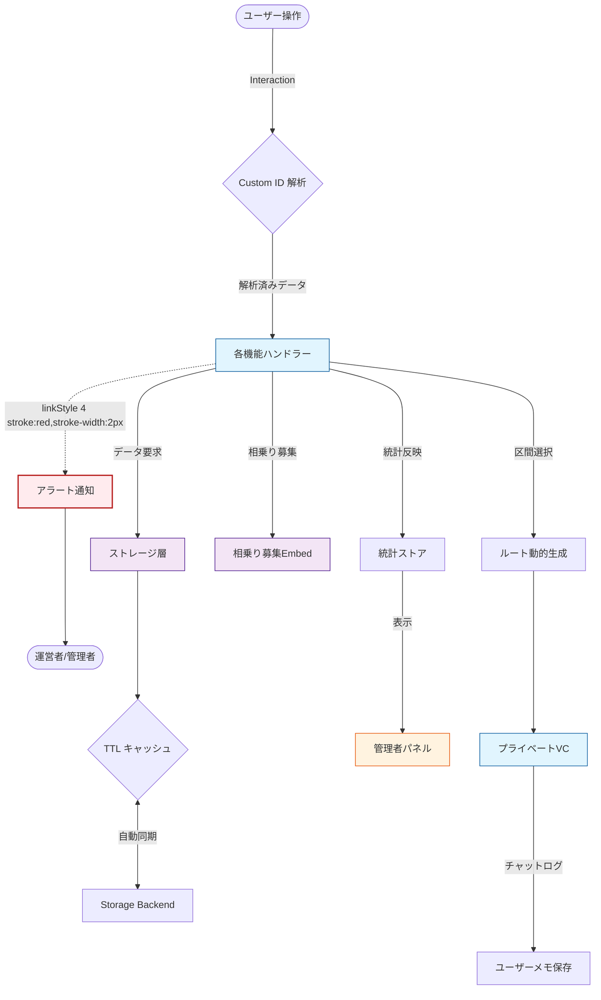
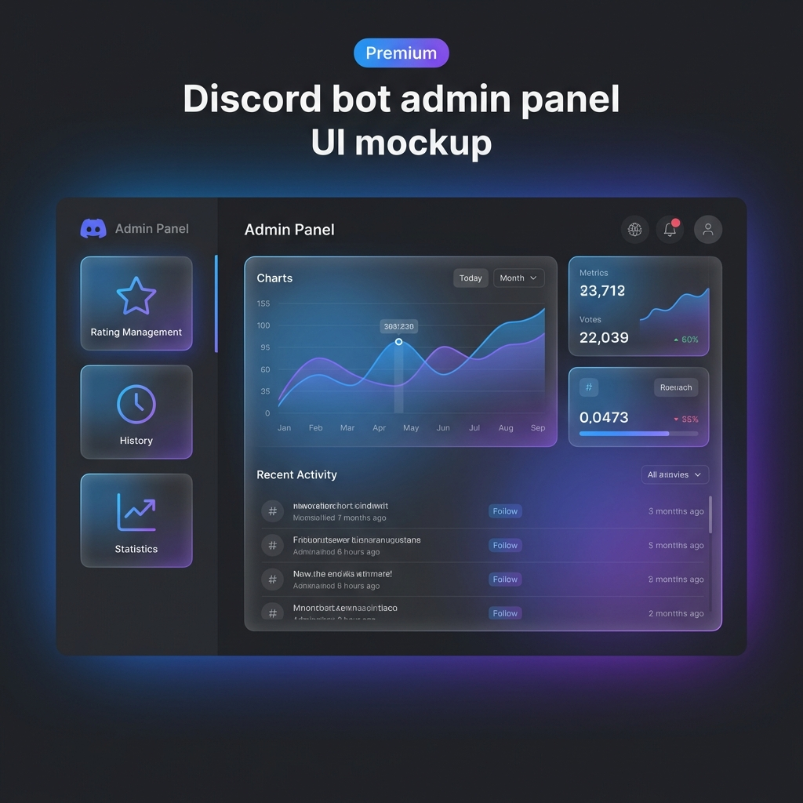
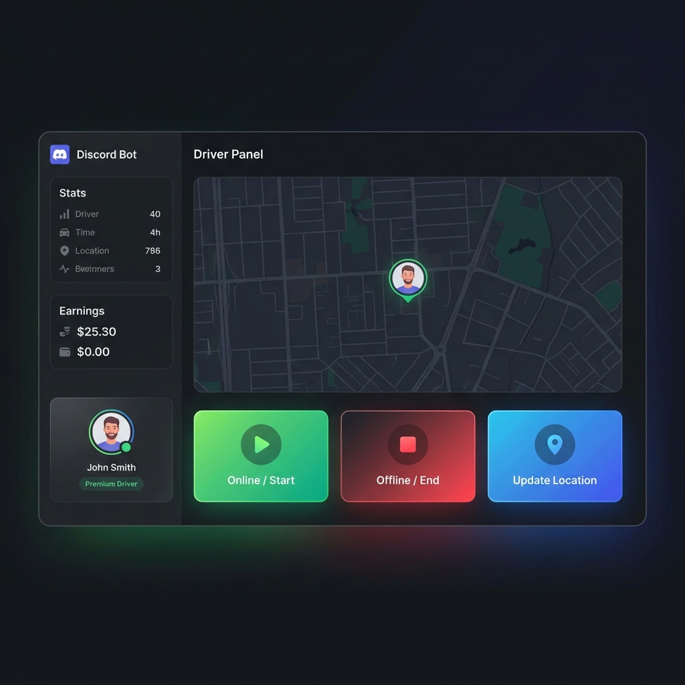
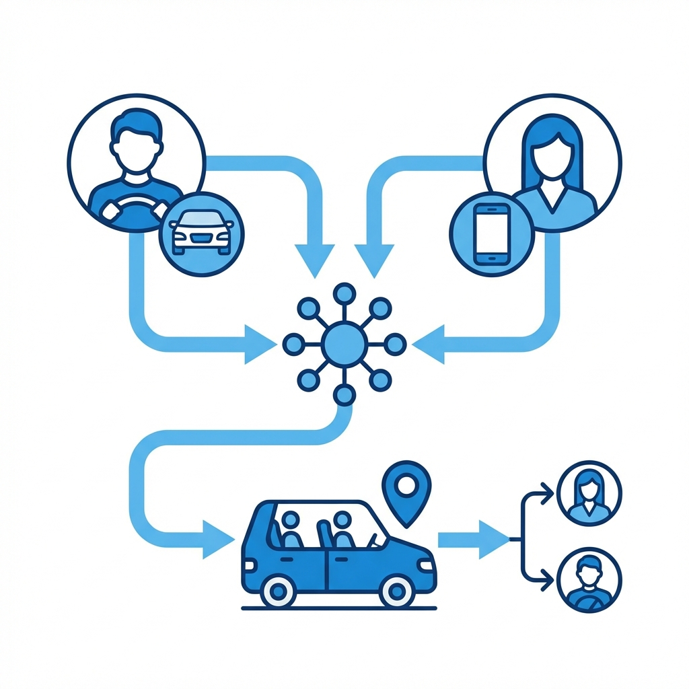
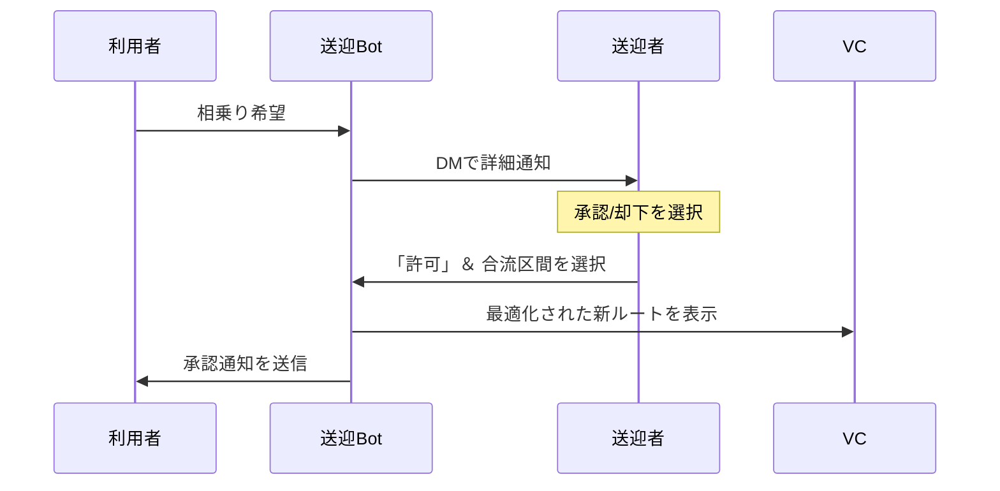

# 🚕 送迎者Bot 運用マニュアル (v1.3.0)

## 📋 目次
- [1. はじめに](#1-はじめに)
  - [📌 概要](#-概要)
  - [⚡ システム構造図](#-システム構造図)
- [🛠️ 主要コマンド・ボタン一覧](#️-主要コマンドボタン一覧)
- [2. 管理者・運営者向けガイド](#2-管理者運営者向けガイド)
  - [2.1 パネル設置パネル](#21-パネル設置パネル-panel-setup)
  - [2.2 管理者パネル](#22-管理者パネル-admin)
- [3. 送迎者向けガイド](#3-送迎者向けガイド)
  - [3.1 出勤管理](#31-出勤管理)
  - [3.2 相乗り承認フロー](#32-相乗り承認フロー)
- [4. 利用者向けガイド](#4-利用者向けガイド)
  - [4.1 配車フロー](#41-配車フロー)
  - [4.2 相乗り (Carpool)](#42-相乗り-carpool)
- [5. システム保守・Q&A](#5-システム保守qa)
  - [5.1 Q&A（現場トラブル対応）](#51-qa現場トラブル対応)
- [� 関連リソース](#-関連リソース)

---

## 1. はじめに

### �📌 概要
このBotは、Discord上での送迎依頼・配車管理、および送迎者の評価・統計管理を自動化するシステムです。
最新バージョン **v1.3.0** では、高度な相乗りシステム、詳細な走行履歴、および洗練された管理者パネルが統合されています。

### ⚡ システム構造図

> **図1: システムフロー解説**
> このフロー図は、ユーザーのボタン操作がどのように解析され、データベース（GCS）やプライベートVCの作成に繋がるかを示しています。すべての操作は監査ログとして記録され、管理者がリアルタイムで状況を把握できる設計になっています。

---

## 🛠️ 主要コマンド・ボタン一覧

| 対象者 | 操作内容 | 実行方法/ボタン | 機能・目的 | 備考 |
| :--- | :--- | :--- | :--- | :--- |
| **全体** | 送迎依頼 | `/依頼` または案内パネル | 配車リクエストを開始 | ✅ 泥酔時は目的地入力をスキップ可能 |
| **送迎者** | 出勤 | 「今から行けます」ボタン | 待機列(FIFO)に参加 | ⚠️ 待機場所が変わったら「現在地更新」 |
| **送迎者** | 退勤 | 「退勤します」ボタン | 待機列から離脱 | ✅ 休憩時も一度退勤を推奨 |
| **送迎者** | 相乗り承認 | DMの「許可」ボタン | 相乗りの受諾とルート調整 | ⚠️ 承認後の「区間選択」を忘れずに |
| **管理者** | パネル設置 | `/パネル設置パネル` | 各種パネルの送信・管理 | ✅ Bot再起動時に自動で最新化される |
| **管理者** | システム管理 | `/管理者パネル` | ログ・統計・評価の管理 | ⚠️ 機密情報はサブパネルで管理 |

---

## 2. 管理者・運営者向けガイド

### 2.1 パネル設置パネル (`/panel-setup`)
Botの各機能をサーバー内に設置するための司令塔です。

- **新規設置**: 設置したいパネルのボタンを押し、プルダウンから送信先のチャンネルを選択します。
- **自動同期**: 設置済みのパネルはBot起動時に自動で最新状態に復旧されます。
- **案内パネル**: 🔰マニュアルを確認しなくても基本操作ができるよう、VCの使い方等をまとめたパネルです。

### 2.2 管理者パネル (`/admin`)
- **🏆 評価・統計・履歴**: 
    - メインパネルから独立したサブパネルで、機密性の高い履歴や統計を確認。
    - **口コミ確認**: 全送迎の評価ページネーション対応。
    - **履歴表示**: 「送迎履歴詳しく」から、過去の全走行ログを日別・月別で確認可能。具体的な操作手順は [Q&A](#51-qa現場トラブル対応) も参照してください。

---

## 3. 送迎者向けガイド

### 3.1 出勤管理

- **現在地更新**: 待機場所が変わった際、利用者に最新情報を伝えるためにこまめに更新してください。

### 3.2 相乗り承認フロー

> **図2: 相乗り承認シーケンス解説**
> 利用者が相乗りを希望すると、Botが即座にドライバーへDMを送信します。ドライバーが「受諾」だけでなく「合流区間」を選択することで、初めてルートが確定し、VC内の案内が更新されます。

---

## 4. 利用者向けガイド

### 4.1 配車フロー
1.  **方面選択**: `/依頼` 後、表示される方面ボタンを選択。
2.  **目的地入力**: モーダルに目印などを記入（「到着時に伝える」も可）。
3.  **マッチング**: ドライバーが決まると自動的にVCが作成され、案内が届きます。詳細は [Q&A](#51-qa現場トラブル対応) を確認してください。

### 4.2 相乗り (Carpool)
- 稼働中の車両がある場合、「相乗りする」ボタンが表示されます。
- 申請後、ドライバーがルートを確認して承認すると、同じVCへ招待されます。

---

## 5. システム保守・Q&A

### 5.1 Q&A（現場トラブル対応）

**Q. 方面ボタンが表示されません**
> **A.** 管理者パネルの「方面リスト編集」でリストが空になっている可能性があります。管理者パネルから方面を一つ以上登録してください。

**Q. ドライバーが承認したのにルート（地図）が変わりません**
> **A.** ドライバーが承認後の「区間選択」を完了していない可能性があります。DMでの最終確認ボタンまで押すよう伝えてください。

**Q. 送迎終了後にVCが消えません**
> **A.** 誤削除防止のため、終了後も一定期間（標準1週間）は保持されます。手動で消したい場合は [管理者パネル](#22-管理者パネル-admin) から操作してください。

**Q. VC内のボタンが反応しません**
> **A.** 通信エラーやDiscord APIの一時的な問題の可能性があります。数秒待ってから再試行するか、管理者へ連絡してください。

**Q. 評価を間違えて送ってしまった**
> **A.** セキュリティ保護のため、一度確定した評価は利用者側からは修正できません。管理者へ相談し、手動での調整を依頼してください。

---

## 📖 関連リソース
- [リリースノート](file:///c:/Users/User/Desktop/送迎bot/src/bot/RELEASE_NOTES.md)
- [フェーズ9検証記録](file:///c:/Users/User/.gemini/antigravity/brain/4b410c02-14bd-41db-97d0-b89047dcf235/walkthrough_v9.md)
