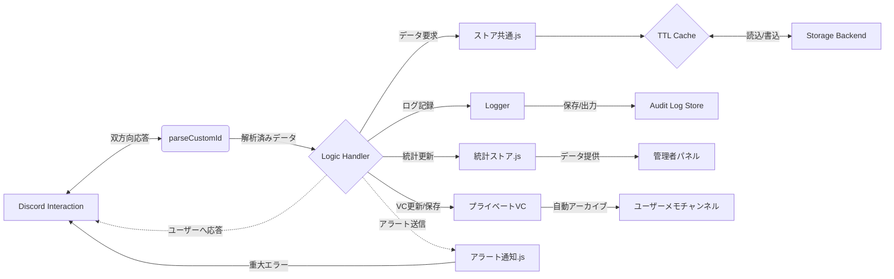

# 送迎者Bot – リリースノート（運用者・管理者向け）

📌 **概要**  
Discord 上で送迎・配車管理を自動化する Bot です。  
第3～第6フェーズの完了により、高精度な設計、自動テスト、統計・評価管理、そして高度な VC ライフサイクル管理を備えた、プロフェッショナルな運用基盤が完成しました。

- **設計の純潔化**: Custom ID 解析の統一、ストレージ層の抽象化による高い保守性。
- **自動化の徹底**: CI による Lint / Format / Unit Test の自動実行。
- **信頼性・運用性**: TTL キャッシュ（10秒）、指数バックオフ再試行、JSON 監査ログ。
- **モニタリング・評価管理**: 稼働統計ダッシュボード、口コミランク管理、異常検知アラート。
- **VC ライフサイクル管理**: 段階的な配車ステータス、チャットログの自動アーカイブ、削除延長機能。

---

## 🎯 主な到達点

### 1️⃣ 第3フェーズ：設計の純潔化と自動化
- **Custom ID 解析**: `parseCustomId` へのロジック集約による脆弱性排除。
- **ストレージ層抽象化**: ローカル/GCS を透過的に扱う facade (`ストア共通.js`)。
- **自動テスト**: Jest によるユニットテストと GitHub Actions での CI 完全同期。

### 2️⃣ 第4フェーズ：信頼性・観測容易性（Observability）
- **監査ログ（Audit Logs）**: 開発者向け(Human)と監査用(JSON)の2系統出力。
- **パフォーマンス**: TTL 付きインメモリキャッシュによる I/O 負荷の極小化。
- **障害耐性**: Interaction 無応答防止ロジックと GCS 再試行。

### 3️⃣ 第5フェーズ：モニタリング・統計分析・評価管理
- **稼働統計システム**: 送迎件数、相乗り成功数、新規登録者数をリアルタイムに自動集計。
- **口コミランク管理**: 星評価分布とコメント履歴の表示、管理者によるランク付与。
- **自動アラート通知**: 致命的エラーを検知し、運営者チャンネルへ即座に通知。

### 4️⃣ 第6フェーズ：高度な配車フローと VC ライフサイクル管理
- **高度なステータス管理**:
    - 「向かっています」→「送迎開始」→「送迎完了」の段階的な操作フロー。
    - VC 内 Embed へのマッチング時間、現在地、目的地の動的表示。
- **ログ自動アーカイブ**:
    - VC 内のチャット履歴を、終了時に「ユーザーメモ」チャンネルへスレッド形式で自動保存。
    - 年月単位のスレッド管理により、過去のやり取りを容易に追跡可能。
- **削除ポリシー改善**:
    - 送迎終了後、1週間の保持期間を設定。トラブル時には「削除延長」も可能。
- **口コミ評価 DM 最適化**:
    - 出発点・目印・目的地を含めた詳細なフォーマットで評価依頼を自動送信。

---

## ⚡ 運用フロー（システム構造）

---

## 🧰 運用・操作ガイド

### 1. Discord 上の操作
| 操作 | 内容 | 備考 |
| :--- | :--- | :--- |
| スラッシュコマンド `/panel` | 管理・案内パネルの設置 | 管理者権限が必要 |
| **📊 統計ダッシュボード** | 本日・今月の稼働状況確認 | 管理者パネルからアクセス |
| **🏆 口コミランク管理** | 評価分布確認・ランク設定 | ユーザーの信頼性管理 |
| **🚗 VC内操作** | 向かっています～送迎完了 | 段階的なボタン操作で進捗管理 |
| **📝 履歴確認** | チャットログアーカイブ | 「ユーザーメモ」チャンネルを確認 |
| **🚨 異常検知アラート** | 致命的エラーの自動通知 | 運営者チャンネルへ即時送信 |

### 2. サーバー管理（エンジニア向け）
| コマンド | 用途 |
| :--- | :--- |
| `npm start` | **本番起動** (通常運用) |
| `npm run dev` | **開発起動** (テスト・デバッグ) |
| `npm test` | 全自動テストの実行 |

---

## 📖 関連ドキュメント
- **[README (基本構成)](https://github.com/hr-redstar/src/blob/main/bot/README.md)**
- **[ARCHITECTURE (詳細設計)](https://github.com/hr-redstar/src/blob/main/bot/docs/ARCHITECTURE.md)**
- **[報告書 (最終まとめ)](file:///c:/Users/User/.gemini/antigravity/brain/4b410c02-14bd-41db-97d0-b89047dcf235/walkthrough.md)**

---
📅 **Last Updated**: 2026-01-17
