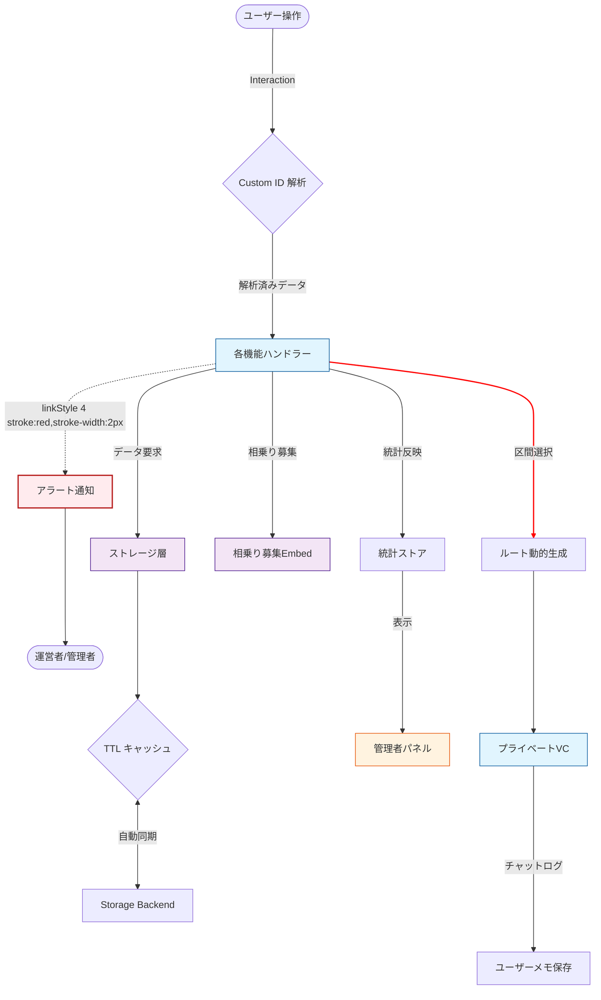

# 送迎者Bot – リリースノート 兼 運用マニュアル

📌 **概要**  
Discord 上で送迎・配車管理を自動化する Bot です。  
第3～第6フェーズの完了により、高精度な設計、自動テスト、統計・評価管理、および高度な VC ライフサイクル管理を備えたプロフェッショナルな運用基盤が完成しました。

## 📝 バージョン履歴 (Version History)

| Version | Date | 主な更新内容 | 開発フェーズ |
| :---: | :--- | :--- | :--- |
| **v1.3.0** | 2026-01-22 | **管理者パネル・設置パネルの改善**  ・管理者パネルUI整理（履歴・統計をサブパネル化）。 ・グローバルログスレッド対応。 ・パネル設置ステータスの表示不整合修正。 ・案内パネルの設置対応。 | Phase 9 |
| v1.2.0 | 2026-01-20 | **評価・ランク・詳細履歴機能の完成**  ・プロフィール Embed にランク・平均評価表示。 ・管理者パネルで日別・送迎履歴閲覧機能追加。 | Phase 8 |
| **v1.1.0** | 2026-01-17 | **相乗りシステム強化 & ユーザーポリシー統合**  ・相乗り方面選択フロー、ルート区間挿入ロジック、スレッディングポリシー実装。 | Phase 7 |
| v0.9.0 | 2026-01-10 | **信頼性・観測性の向上。**  ・TTLキャッシュ、GCS再試行ロジックの導入 ・Human/Audit 2系統ログ、重大エラーの自動アラート基盤 | Phase 4-5 |
| v0.5.0 | 2026-01-05 | **基盤設計の刷新。**  ・Custom ID解析の統一、ストレージ層の完全抽象化 ・Jestによる単体テスト導入、GitHub Actions CI同期 | Phase 3 |

---

## ⚡ システム構造（運用フロー）

---

## 🧰 運用・操作ガイド

### 1. 利用者操作（配車・相乗り）
- **方面・目的地選択**: `/依頼` や案内パネルのボタンを押すと、まず「方面」ボタンが表示されます。
- **詳細入力**: 方面選択後、モーダルで具体的な目的地を入力可能です（入力困難な場合はスキップ可）。
- **ステータス確認**: VC内のEmbedで、現在のルートやドライバーの状況がリアルタイムに表示されます。

### 2. 送迎者操作（相乗り承認・ルート構築）
- **承認通知**: 相乗り希望が届くと、ドライバーの個人DMに通知が届きます。
- **区間選択**: 「許可」する場合、相乗り者がどの区間（【現在地】→【当初目印】など）で合流するかを選択します。
- **自動同期**: 選択後、VC内の案内メッセージと募集中の相乗りEmbedが自動的に新ルートに更新されます。

### 3. ユーザー登録・ポリシー設定
- **初回登録**: 登録時、基本情報の入力後に「履歴まとめ期間」を選択します。
- **まとめ期間**: 1週間 / 2週間 / 1ヶ月 / 半年 / なし から選択でき、これに基づきユーザーメモ内のスレッドが自動管理されます。

### 4. 管理者操作・ログ監視
- **方面管理**: 管理パネルの「方面リスト」で、利用者に表示する選択肢をカスタマイズできます。
- **ログ確認**: `運営者ログ` および `システム管理スレッド` で全体の動きを監視します。
- **履歴閲覧**: 管理者パネルの「送迎履歴詳しく」から、過去の走行ルートや相乗り状況を日別に確認できます。
- **ユーザー評価**: 登録状態確認ボタンから、自分の最新ランクと平均評価（⭐）を確認できます。
- **期間保持**: 送迎終了後1週間はVCを維持し、必要に応じて「削除延長」で延長可能です。

### 5. システムメンテナンス（エンジニア向け）
| コマンド | 内容 | 備考 |
| :--- | :--- | :--- |
| `npm start` | **本番起動** | 通常運用。Node.js v18/v20 推奨。 |
| `npm run dev` | **開発/検証** | `nodemon` によりコード変更が即反映されます。 |
| `npm test` | **品質テスト** | 変更後のシステム不整合をチェックします。 |

---

## ⚠️ トラブルシューティング（現場Q&A）

- **Q. VC内のボタンが反応しません**
  - **原因**: 複数のユーザーが同時に押したか、Discord API の遅延です。
  - **対策**: 数秒待って Embed の表示が更新されているか確認してください。更新されない場合は、ページをスクロール（再描画）するか、管理者にご連絡ください。

- **Q. 統計データの件数が合わない気がする**
  - **原因**: 統計は「双方の送迎終了ボタンが押された瞬間」にカウントされます。また、**日次統計は毎日 0:00（日本時間）にリセット**されます。
  - **対策**: 配車が完了ステートになっているか、前日分の集計でないかを確認してください。

- **Q. チャンネルが消えてしまったが、やり取りを見たい**
  - **対策**: 対象ユーザーの「ユーザーメモ」チャンネルのスレッド（例：2026年1月 ログ）を検索してください。アーカイブが自動保存されています。

- **Q. 方面ボタンが出てきません**
  - **対策**: 管理パネルで「方面リスト」が登録されているか確認してください。未登録の場合は、管理パネルから方面を設定してください。

- **Q. ドライバーが承認したのにルートが変わりません**
  - **対策**: ドライバーが「区間選択」を完了していない可能性があります。DMでの操作を最後まで完了させるよう伝えてください。

- **Q. 過去のチャットログをまとめて見たい**
  - **対策**: ユーザー登録時に「1週間ごとにまとめる」などのポリシーが設定されていれば、ユーザーメモチャンネル内のスレッドに期間ごとに集約されています。

---

## 📖 関連ドキュメント
- [📖 v1.3.0 統合運用マニュアル](file:///c:/Users/User/Desktop/送迎bot/src/bot/OPERATIONS_MANUAL_v1.3.0.md)
- [📜 セットアップ手順・環境変数設定 (README)](https://github.com/hr-redstar/src/blob/main/bot/README.md)
- [🏗️ 設計思想・日本語ディレクトリ運用ルール (ARCHITECTURE)](https://github.com/hr-redstar/src/blob/main/bot/docs/ARCHITECTURE.md)
- [✅ フェーズ 9：管理者パネル・設置パネル改善検証記録 (walkthrough)](file:///c:/Users/User/.gemini/antigravity/brain/4b410c02-14bd-41db-97d0-b89047dcf235/walkthrough_v9.md)

---
📅 **Final Updated**: 2026-01-17
