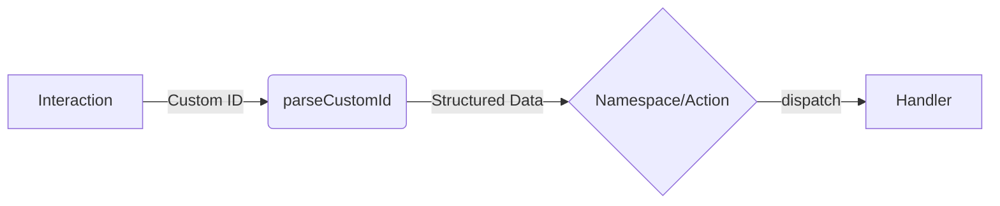
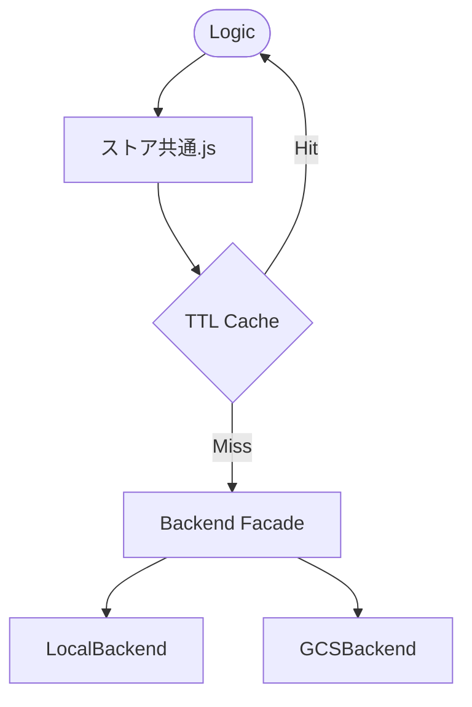
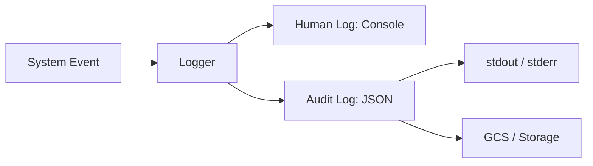

# アーキテクチャ設計書 (送迎者Bot)

本ドキュメントでは、第3・第4フェーズで確立されたシステムのコア設計方針を記述します。

## 1. Custom ID 設計 (Design Purity)
Custom ID は以下の仕様に完全準拠し、すべてのハンドラーは `parseCustomId` を通じて構造化データにアクセスします。

- **形式 (v2)**: `namespace|action|param1=val1&param2=val2`
- **原則**: ハンドラー内での `split()` による直接分解を禁止。

## 2. ストレージ抽象化 (Storage Abstraction)
データストアへのアクセスは `ストア共通.js` を唯一の窓口とし、バックエンド（Local/GCS）の差異を隠蔽します。

- **TTLキャッシュ**: read 操作に対して 10秒の TTL キャッシュを適用。
- **不整合防止**: write/delete 操作時に即座にキャッシュを無効化（Invalidation）。

## 3. 監査・観測容易性 (Observability)
ログは用途に応じて2系統に出力されます。

- **Human-log**: コンソール出力用。色付きテキストで開発者が直感的に把握可能。
- **Audit-log**: 構造化JSON。Cloud Logging との親和性が高く、管理者パネルから検索可能。
- **標準タグ**: `CONFIG`, `SECURITY`, `RIDE`, `ERROR`, `SYSTEM`

## 4. 障害耐性 (Reliability)
- **GCSBackend**: ネットワークエラー等の一時的な失敗に対し、最大 3 回の指数バックオフ付きリトライを実施。
- **Interaction**: エラー発生時も `graceful degradation` により Discord Interaction のタイムアウトや Bot の無応答を防止。

## 5. 品質保証 (QA Automation)
- **CI**: GitHub Actions により、すべての PR で `Lint`, `Format`, `Unit Test` の通過を義務付け。
- **Coverage**: `utils`, `storage`, `parser` などのコアモジュールでカバレッジ 80% 以上を維持。
