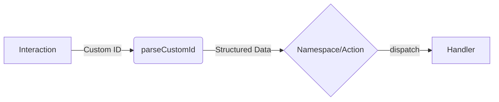
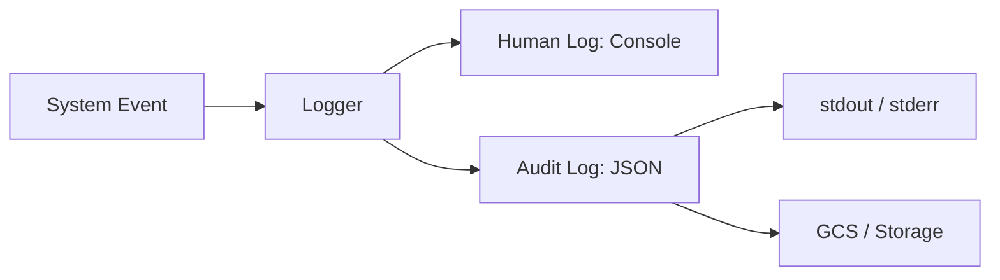
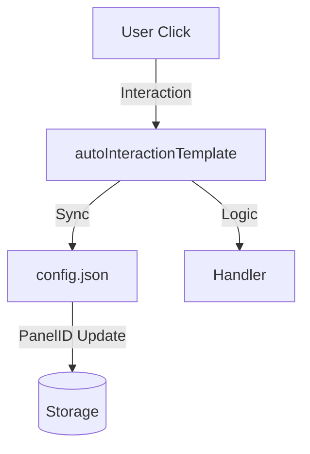

# アーキテクチャ設計書 (送迎者Bot)

本ドキュメントでは、システムのコア設計方針および v3.0.0 で導入された自律制御メカニズムを記述します。

## 1. Custom ID 設計 (Design Purity)
Custom ID は以下の仕様に完全準拠し、すべてのハンドラーは `parseCustomId` を通じて構造化データにアクセスします。



- **形式 (v2)**: `namespace|action|param1=val1&param2=val2`
- **原則**: ハンドラー内での `split()` による直接分解を禁止。

## 2. ストレージ抽象化 (Storage Abstraction)
データストアへのアクセスは `ストア共通.js` を唯一の窓口とし、バックエンド（Local/GCS）の差異を隠蔽します。


- **TTLキャッシュ**: read 操作に対して 10秒の TTL キャッシュを適用。
- **不整合防止**: write/delete 操作時に即座にキャッシュを無効化（Invalidation）。

## 3. 監査・観測容易性 (Observability)
ログは用途に応じて2系統に出力されます。



- **Human-log**: コンソール出力用。
- **Audit-log**: 構造化JSON。管理者パネルから検索可能。

## 4. 自律型UI・自己修復 (Self-Healing UI) [v3.0.0]
すべてのパネル・ボタンは「配置場所」を自己宣言し、設定を正常化します。



- **ID同期プロトコル**: ボタンが押された際、そのメッセージが最新のパネルであると認識し、自動的に `messageId` を更新。
- **Ephemeralガード**: 一時メッセージ（セレクトメニュー等）による設定の上書きを論理的に遮断。

## 5. サーバー構築自動化 (Auto-Setup Orchestration) [v3.0.0]
初期デプロイ時のコストを最小化するための全自動セットアップ。

```mermaid
graph LR
    Cmd[/自動設定パネル] --> Logic[setupLogic.js]
    Logic --> Util[setupUtils]
    Logic --> Builders[Panel Builders]
    Util -->|Idempotent| Discord[Discord API]
    Builders -->|Auto-Deploy| Discord
```

- **べき等実行**: 同名チャンネルがあれば作成をスキップし、構成の同期のみを実施。

## 6. アトミック待機列管理 (Atomic Queue Management) [v3.0.0]
高負荷時の重複配車を物理的に防止します。

- **`queue.json`**: 単一インデックスによる集中管理。
- **楽観的ロック**: `store.updateJson` により、競合検出時に自動でリトライを実施。

## 7. 品質保証 (QA Automation)
- **CI**: GitHub Actions により、PR ごとの品質チェックを実施。
- **Coverage**: コアモジュールでカバレッジ 80% 以上を維持。
